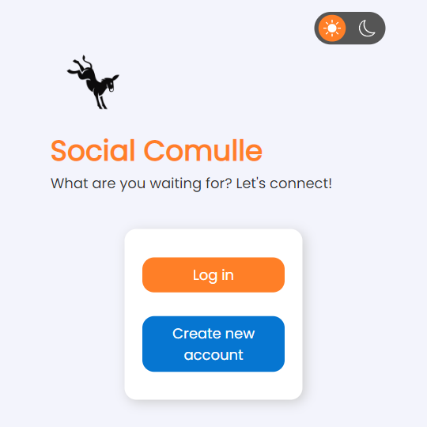

# social-media-clone

Social Media React App with Firebase

@gontluc june 2022

 

 

## Features

* Custom scroll bar

* Dark Mode

* Google login authenctication

* Search bar

* Create a post and delete a post 

* Friends to follow and unfollow

* Weather API

* Like button and comment section

* Create account and delete account

* Sign in and log out

* User status

* Click on profiles

* AND MORE...

 

## Dependencies 

react-icons

firebase

react-firebase-hooks

axios

 

## React Hooks

useState()
useEffect()

Firebase hooks:

useAuthState()
useCollectionData()

 

## Backend

Firebase --> Cloud Firestore